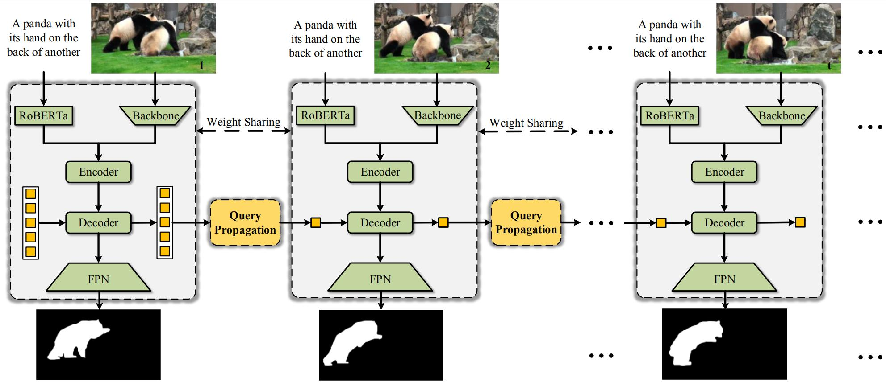

<div align="center">
<h1>
<b>
OnlineRefer: A Simple Online Baseline for Referring Video Object Segmentation
</b>
</h1>
</div>

<p align="center"></p>

> **[OnlineRefer: A Simple Online Baseline for Referring Video Object Segmentation](https://arxiv.org/abs/2307.09356)**
>
> Dongming Wu, Tiancai Wang, Yuang Zhang, Xiangyu Zhang, Jianbing Shen 

### Abstract

Referring video object segmentation (RVOS) aims at segmenting an object in a video following human instruction. Current state-of-the-art methods fall into an offline pattern, in which each clip independently interacts with text embedding for cross-modal understanding. They usually present that the offline pattern is necessary for RVOS, yet model limited temporal association within each clip. In this work, we break up the previous offline belief and propose a simple yet effective online model using explicit query propagation, named OnlineRefer. Specifically, our approach leverages target cues that gather semantic information and position prior to improve the accuracy and ease of referring predictions for the current frame. Furthermore, we generalize our online model into a semi-online framework to be compatible with video-based backbones. To show the effectiveness of our method, we evaluate it on four benchmarks, \ie, Refer-Youtube-VOS, Refer-DAVIS17, A2D-Sentences, and JHMDB-Sentences.  Without bells and whistles, our OnlineRefer with a Swin-L backbone achieves 63.5 J&F and 64.8 J&F on Refer-Youtube-VOS and Refer-DAVIS17, outperforming all other offline methods. 
## Update
- **(2023/07/18)** OnlineRefer is accepted by ICCV2023. The online mode is released.


## Setup

The main setup of our code follows [Referformer](https://github.com/wjn922/ReferFormer).

Please refer to [install.md](docs/install.md) for installation.

Please refer to [data.md](docs/data.md) for data preparation.

## Training and Evaluation
If you want to train and evaluate our online model on Ref-Youtube-VOS using backbone **ResNet50**, please run the following command:
```
sh ./scripts/online_ytvos_r50.sh
```

If you want to train and evaluate our online model on Ref-Youtube-VOS using backbone **Swin-L**, please run the following command:
```
sh ./scripts/online_ytvos_swinl.sh
```

Note: The models with ResNet50 are trained using 8 NVIDIA 2080Ti GPU, and the models with Swin-L are trained using 8 NVIDIA Tesla V100 GPU.

## Model Zoo

### Ref-Youtube-VOS

Please upload the zip file to the [competition server](https://competitions.codalab.org/competitions/29139#participate-submit_results).

| Backbone|  J&F  |   J   |  F   |                                                Pretrain                                                |                                                        Model                                                        | Submission |
| :----: |:-----:|:-----:|:----:|:------------------------------------------------------------------------------------------------------:|:-------------------------------------------------------------------------------------------------------------------:|:----------:|
| ResNet-50 | 57.3  | 55.6  | 58.9 |    [weight](https://github.com/wudongming97/OnlineRefer/releases/download/v1.0/r50_pretrained.pth)     |          [model](https://github.com/wudongming97/OnlineRefer/releases/edit/v1.0/ytvos-r50-checkpoint.pth)           |     -      |
| Swin-L | 63.5 | 61.6 | 65.5 | [weight](https://github.com/wudongming97/OnlineRefer/releases/download/v1.0/swin_large_pretrained.pth) |             [model](https://drive.google.com/file/d/1wTEf5Z-EmmtPJkWaUPFDpcRg8vuCsV2X/view?usp=sharing)             |     -      | 


### Ref-DAVIS17

As described in the paper, we report the results using the model trained on Ref-Youtube-VOS without finetune.

| Backbone| J&F  |  J   |  F   |                                              Model                                               | 
| :----: |:----:|:----:|:----:|:------------------------------------------------------------------------------------------------:|
| ResNet-50 | 59.3 | 55.7 | 62.9 | [model](https://github.com/wudongming97/OnlineRefer/releases/edit/v1.0/ytvos-r50-checkpoint.pth) |
| Swin-L | 64.8 | 61.6 | 67.7 |   [model](https://drive.google.com/file/d/1wTEf5Z-EmmtPJkWaUPFDpcRg8vuCsV2X/view?usp=sharing)    |


[//]: # (## Visualizations)

[//]: # (- Ref-DAVIS17)

[//]: # ()
[//]: # ()

[//]: # ()
[//]: # (- Ref-Youtube-VOS)

[//]: # ()
[//]: # ()


[//]: # (- Testing on long videos &#40;selected from Youtube-VIS 2021&#41;)


## Acknowledgement

- [Deformable DETR](https://github.com/fundamentalvision/Deformable-DETR)
- [ReferFormer](https://github.com/wjn922/ReferFormer)
- [MTTR](https://github.com/mttr2021/MTTR)
- [MOTR](https://github.com/megvii-research/MOTR)


## Citation

If you find OnlineRefer useful in your research, please consider citing:


```
@article{wu2023onlinerefer,
  title={OnlineRefer: A Simple Online Baseline for Referring Video Object Segmentation},
  author={Wu, Dongming and Wang, Tiancai and Zhang, Yuang and Zhang, Xiangyu and Shen, Jianbing},
  journal={arXiv preprint arXiv:2307.09356},
  year={2023}
}
```

